# MyWAPP - Mycelium WebAPP

It is the official webapp for the Mycelium API Gateway project.

## Features

[MAG (Mycelium API Gateway)](https://github.com/LepistaBioinformatics/mycelium) is a
ready-to-use API Gateway for your microservices. MyWAPP is a webapp that allows
you to manage your API Gateway.

### Authentication

MAG should support any identity provider that implements [OAuth
2.0](https://oauth.net/2/) protocol. Then MyWAPP implements the authentication
based on Auth0 identity provider, but feel free to use any other provider.

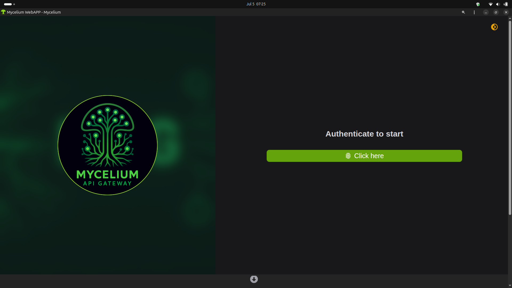

### Dashboard

You should manage your API Gateway resources in the Dashboard page.

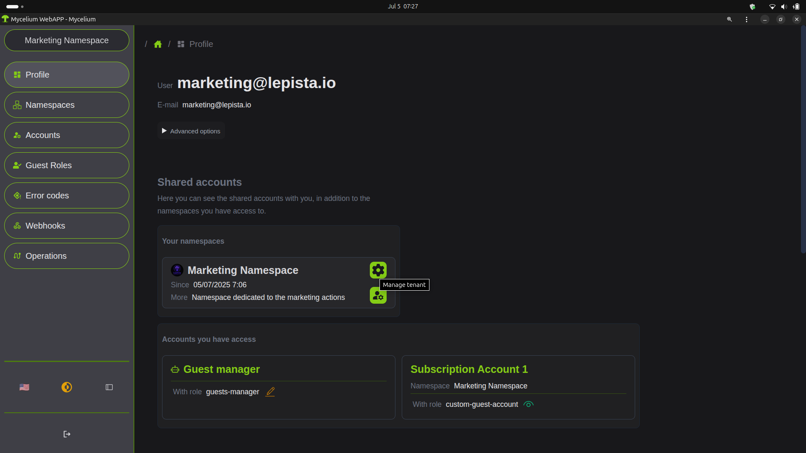

### Tenant Management

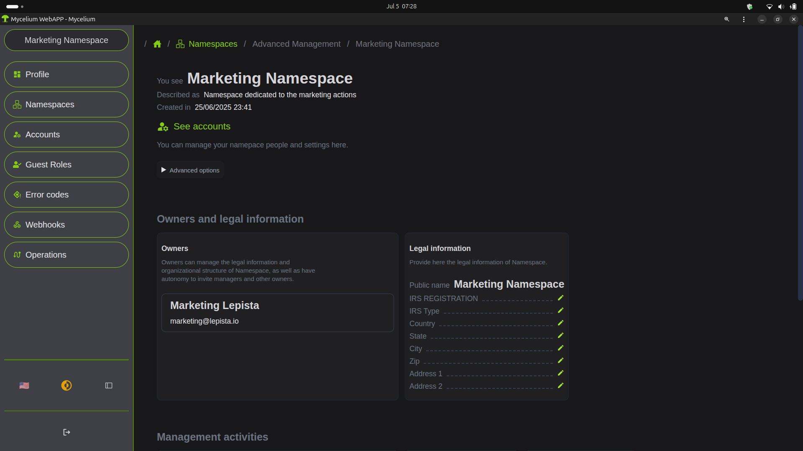

### Account Details Page

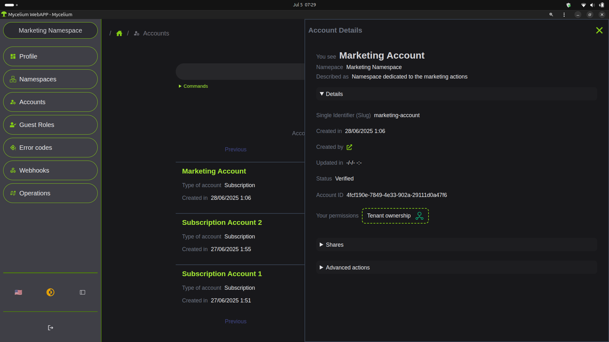

### Account Sharing

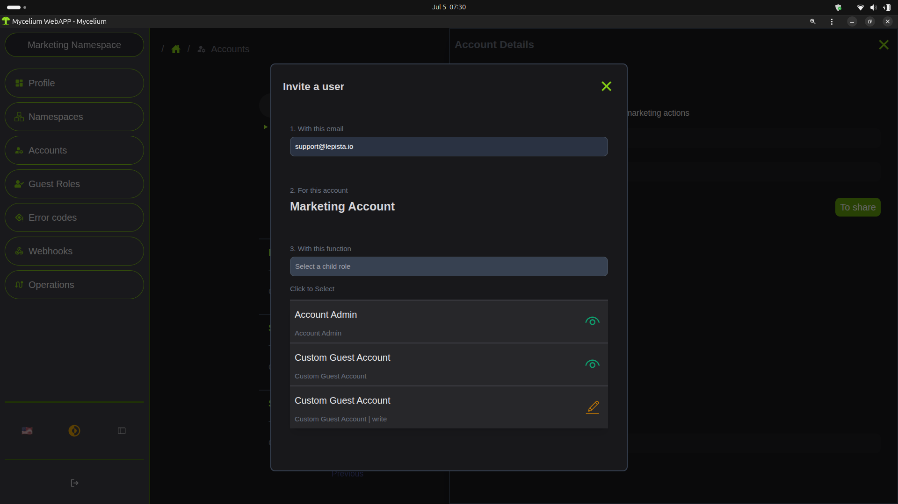

### Fine Grant Connection String Management

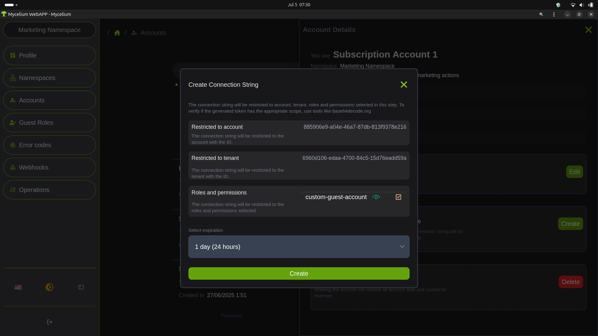

### Roles System Page

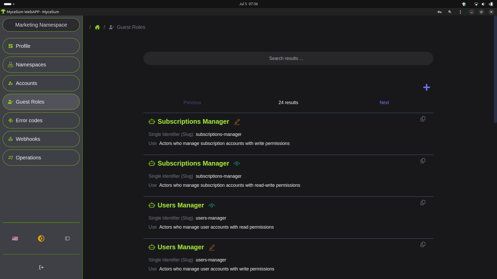

### Webhooks Page

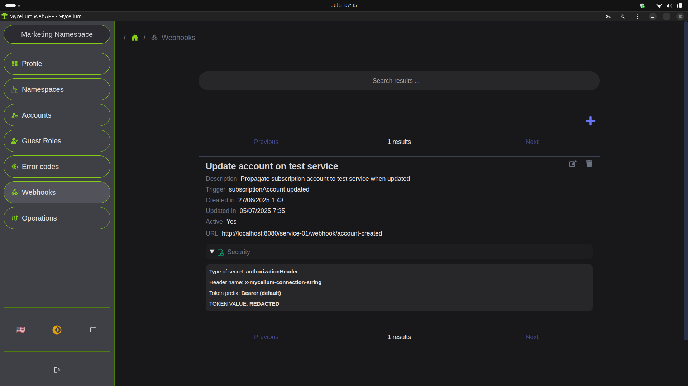

### Operations Page

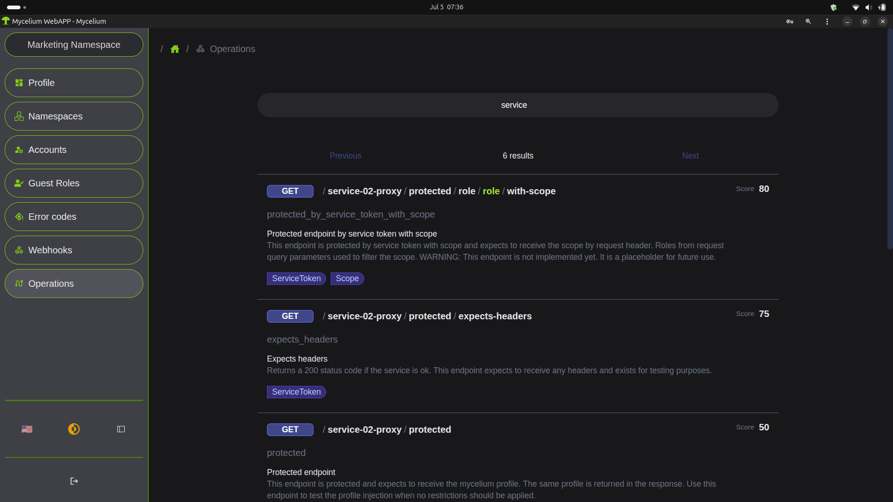

### Mobile App

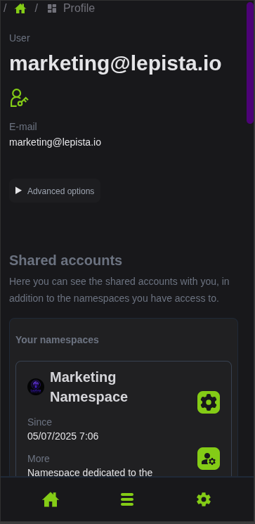

### Multi-language support

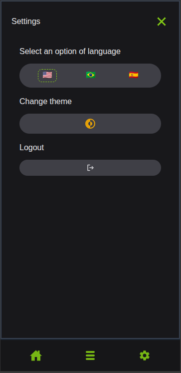
