# MyWAPP - Mycelium WebAPP

It is the official webapp for the Mycelium API Gateway project.

## Getting Started

Releases published on the [Releases page](https://github.com/LepistaBioinformatics/mycelium-webapp/releases)
are source-only (tag + changelog) — there's no prebuilt static bundle, since the
API endpoint is compiled into the build at build time and can't be swapped
afterwards. To run the app against your own [MAG](https://github.com/LepistaBioinformatics/mycelium)
instance:

```bash
git clone https://github.com/LepistaBioinformatics/mycelium-webapp.git
cd mycelium-webapp
cp .env.example .env.production   # point VITE_MYCELIUM_API_URL at your gateway
yarn install
yarn build
yarn preview                      # serves dist/ locally
```

For local development instead of a static build, copy `.env.example` to
`.env.local` and run `yarn dev`.

## Features

[MAG (Mycelium API Gateway)](https://github.com/LepistaBioinformatics/mycelium) is a
ready-to-use API Gateway for your microservices. MyWAPP is a webapp that allows
you to manage your API Gateway.

### Authentication

MAG should support any identity provider that implements [OAuth
2.0](https://oauth.net/2/) protocol. Then MyWAPP implements the authentication
based on Auth0 identity provider, but feel free to use any other provider.

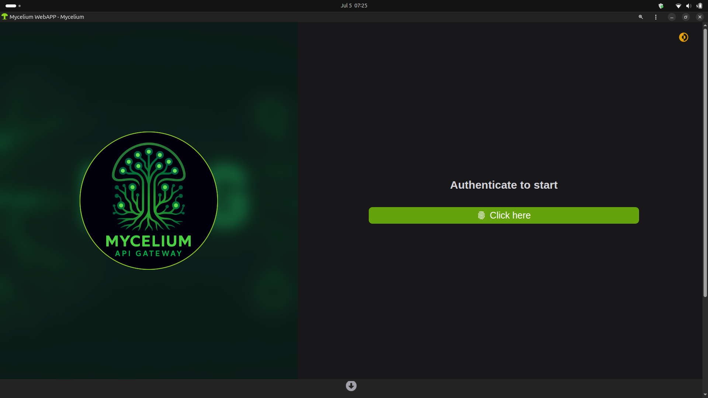

### Dashboard

You should manage your API Gateway resources in the Dashboard page.

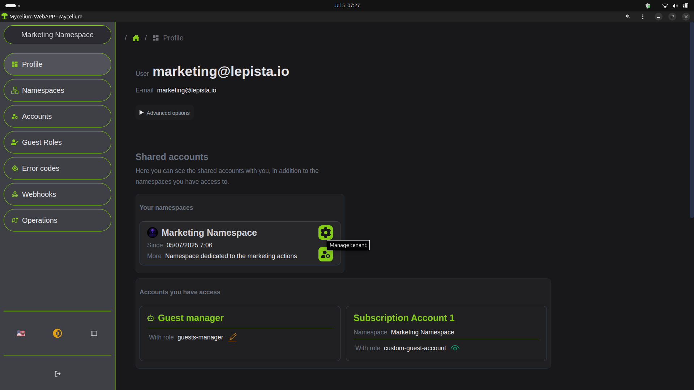

### Tenant Management

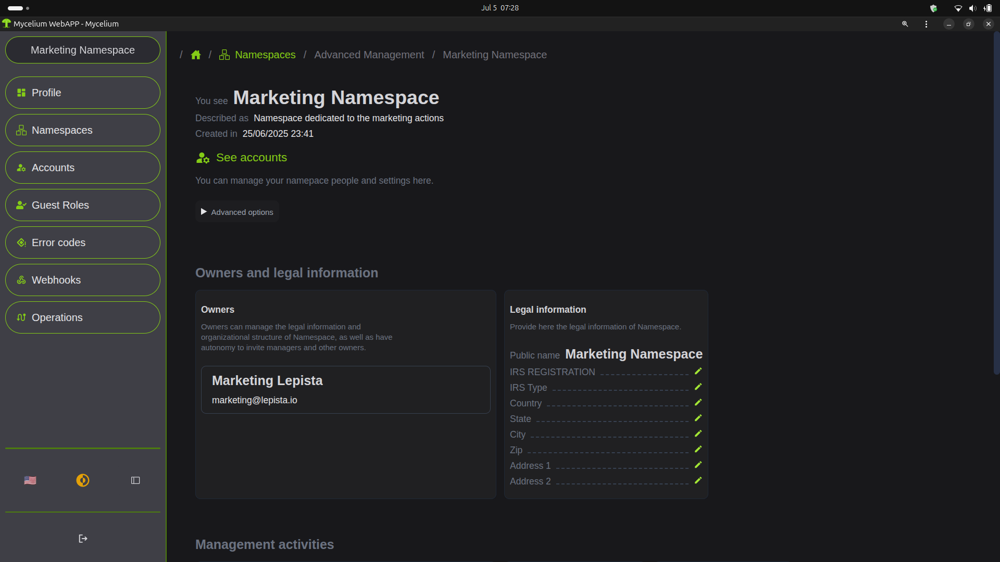

### Account Details Page

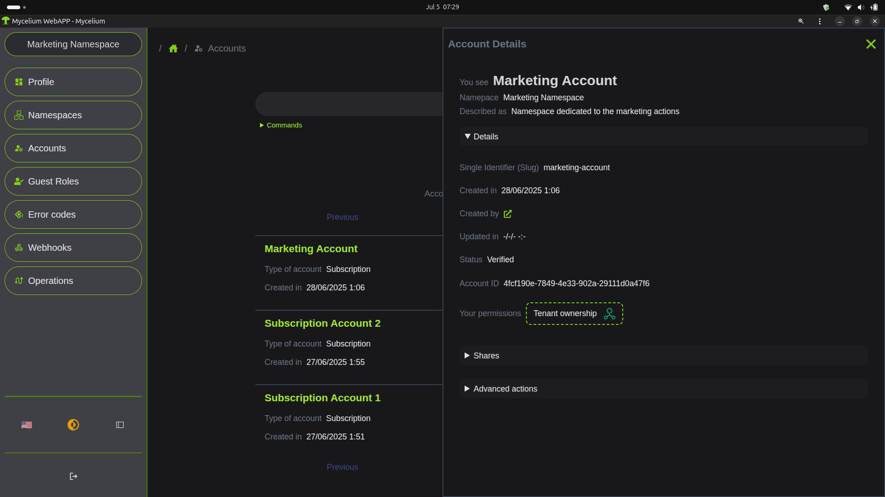

### Account Sharing

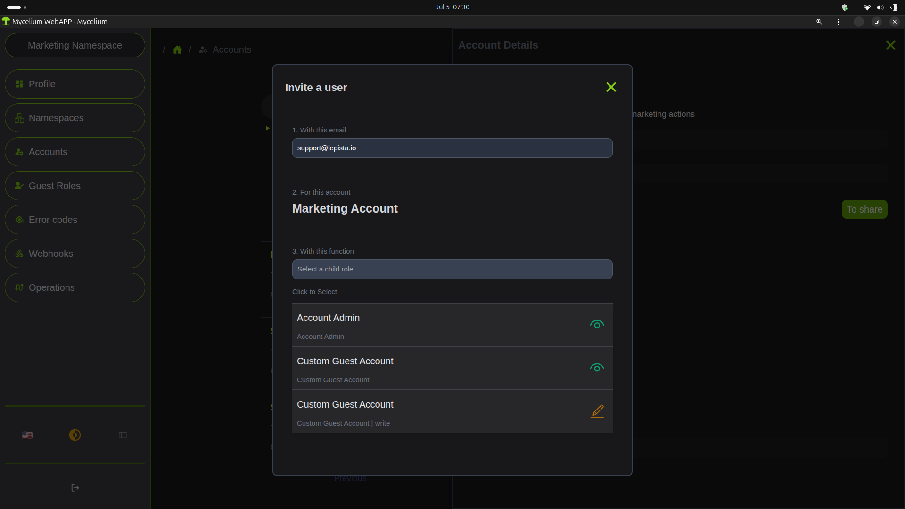

### Fine Grant Connection String Management

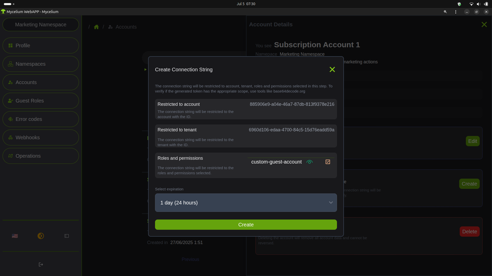

### Roles System Page

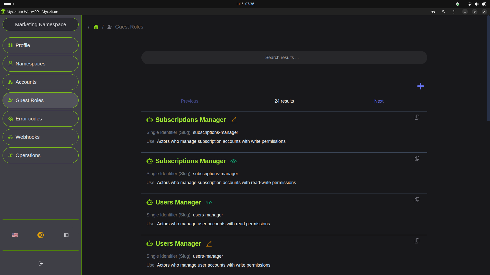

### Webhooks Page

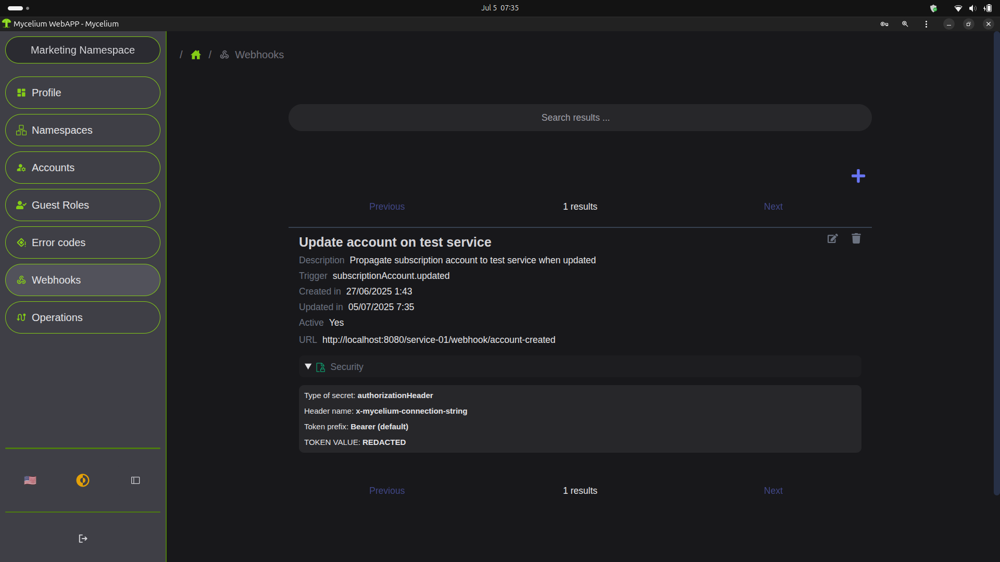

### Operations Page

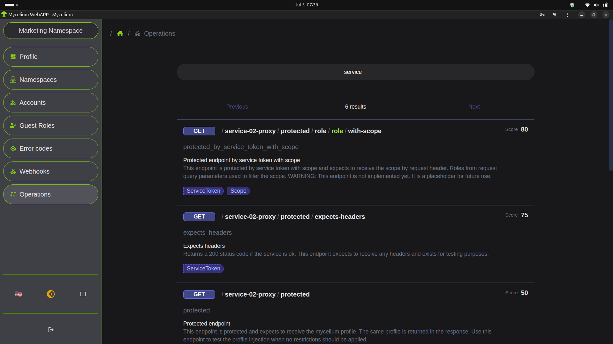

### Mobile App

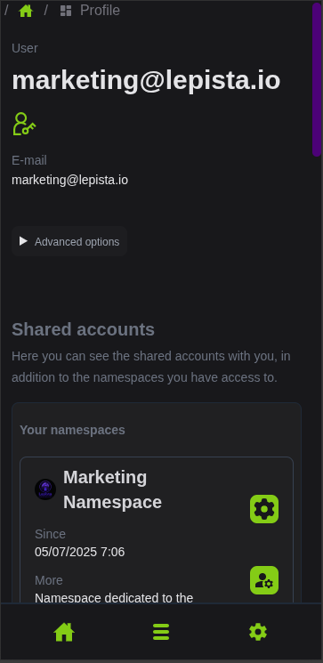

### Multi-language support

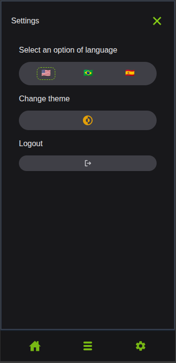
